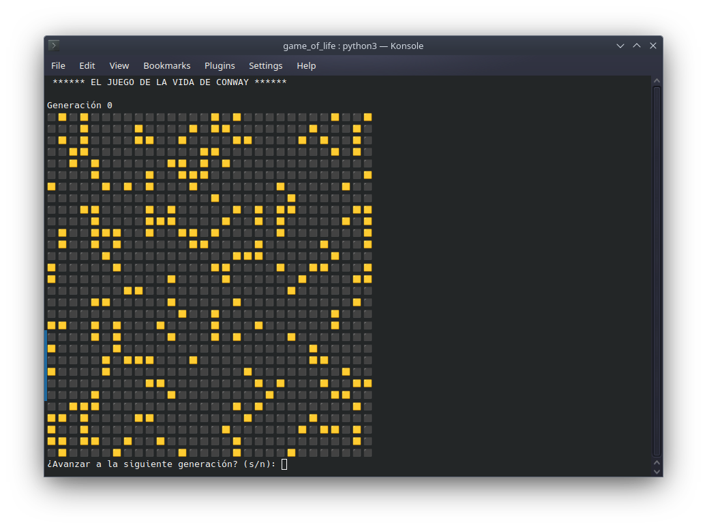
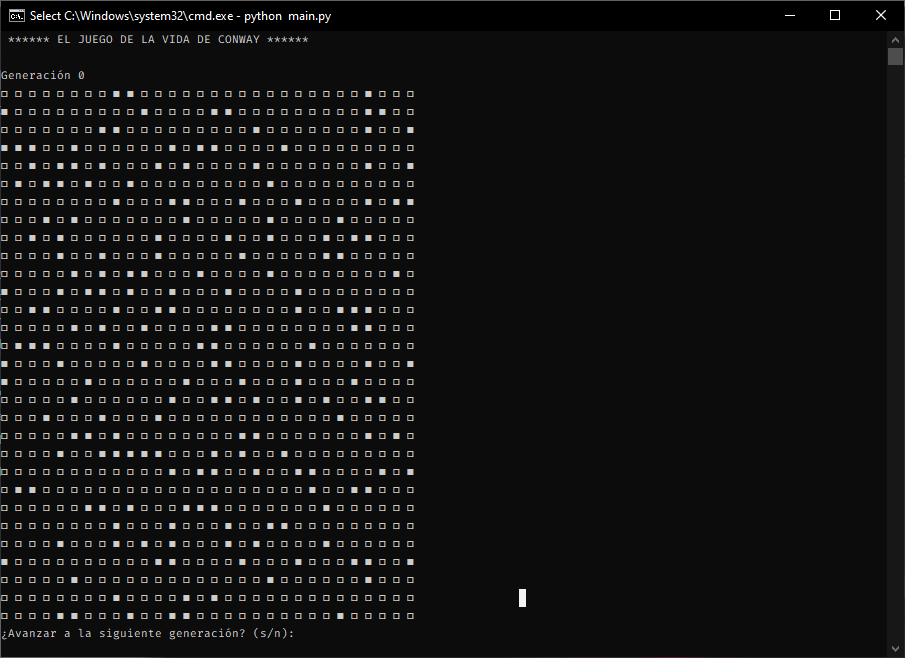

# 🧬 Conway Game of Life

A terminal-based implementation of **Conway's Game of Life** written in Python.

This project simulates Conway's famous cellular automaton using a two-dimensional matrix and renders each generation directly in the console.

---

## ✨ Features

- 🖥️ Console-based visualization
- 🔄 Interactive generation-by-generation execution
- 🌍 Cross-platform terminal support
- 🎲 Random world initialization
- 🌀 Optional toroidal world logic
- 🧩 Clean and modular Python implementation

---

## 📜 Rules

The simulation follows the classic rules of Conway's Game of Life:

- ☠️ A live cell dies if it has fewer than 2 live neighbors.
- 💥 A live cell dies if it has more than 3 live neighbors.
- 🌱 A dead cell becomes alive if it has exactly 3 live neighbors.
- 🔁 Otherwise, the cell keeps its current state.

---

## 📦 Requirements

- Python 3.x

No external libraries are required.

---

## 🚀 Running the Program

Clone the repository:

```bash
git clone https://github.com/your-username/conway-game-of-life.git
cd conway-game-of-life
```

Run the program:

```bash
python main.py
```

---

## 🎮 Controls

| Input | Action |
|---|---|
| `s` or `Enter` | Advance to the next generation |
| `n` | Exit the program |

---

## 📸 Screenshots

### 🐧 Linux / macOS



---

### 🪟 Windows



---

## 📁 Project Structure

```text
.
├── main.py
└── README.md
```

---

## 📝 Notes

- The program automatically adjusts cell symbols depending on the operating system terminal compatibility.
- The toroidal neighbor counting implementation is included in the source code and can be enabled manually.

---

## 👨‍💻 Author

Developed by:
- [Víctor Camilo Cañón Castellanos](https://github.com/vcanonc)
